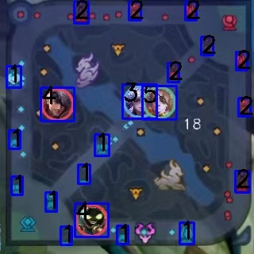

## 数据生成

* 生成小地图检测数据集 jpg + json 格式，查看create_datas.py。 通过设置iou_threshold，控制英雄遮挡情况。默认0.25。
  ```python 
  label2num ={
      "bg": 0, 
      "our_tower": 1,
      "enemy_tower": 2,
      "our_hero": 3,
      "enemy_hero":4,
      "my_hero": 5
      }
  ```
* 示例图片<br>

  <br>


* 生成小地图检测数据集并且直接转换成 TFRecord，查看create_tfrecord.py

  ```python
  python create_tfrecord.py --output=./tfrecords/ --num_shards=2
  ```
  
